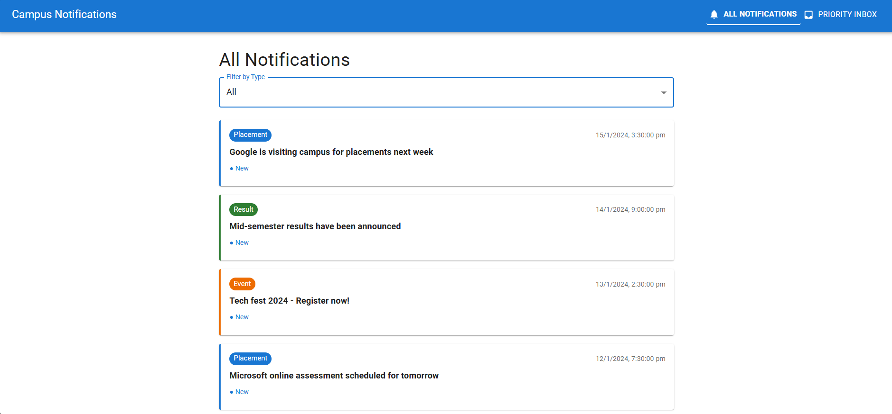
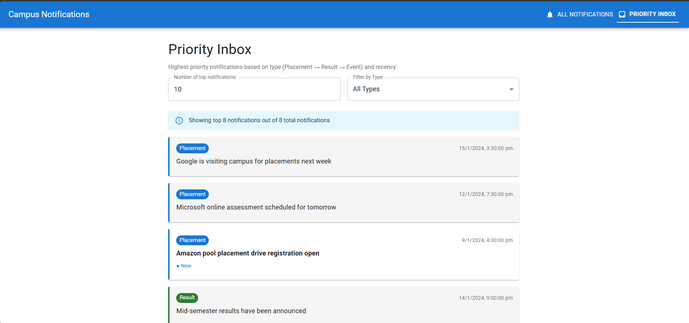
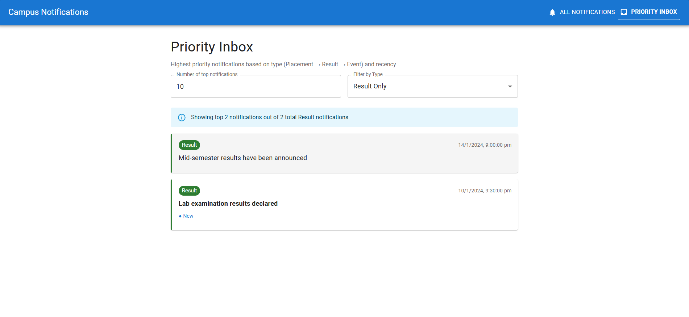
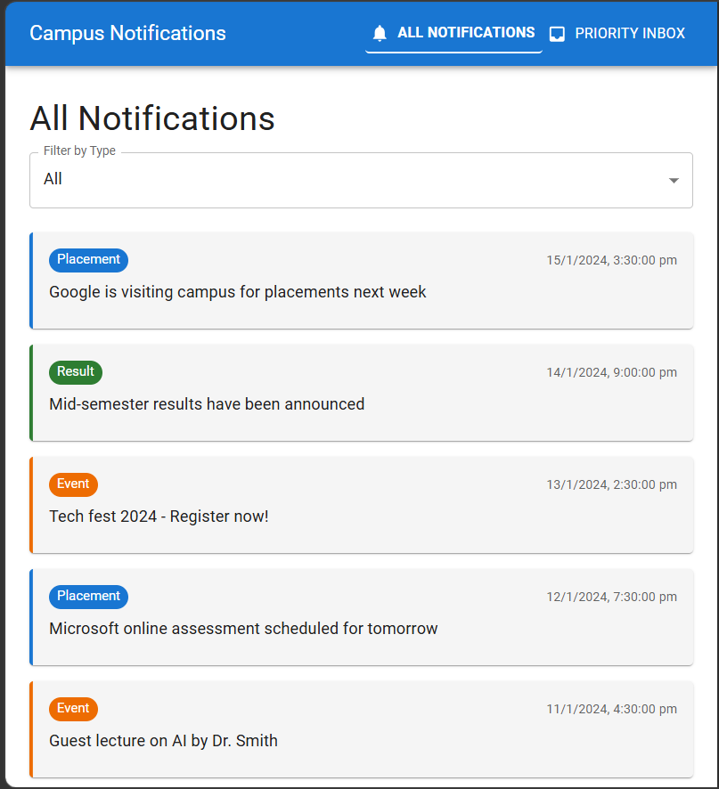
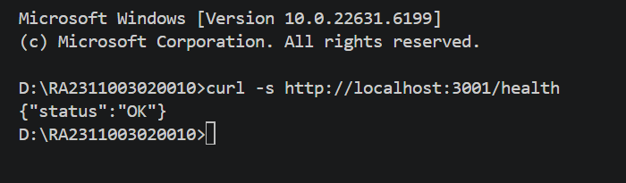
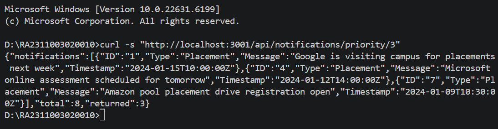
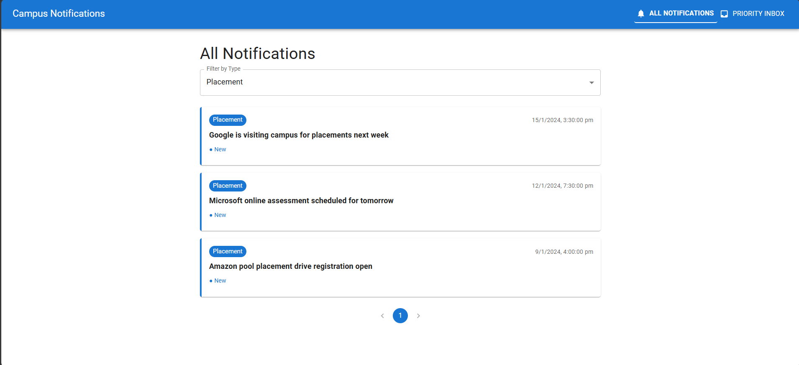

# Campus Notifications Frontend

React frontend for the Campus Notifications System.

## Overview

The frontend provides a user-friendly interface for viewing campus notifications with features like:
- All Notifications page with filtering and pagination
- Priority Inbox for important notifications
- Responsive design for all devices
- Read status tracking

## Prerequisites

- Node.js >= 18.0.0
- npm >= 9.0.0

## Installation

```bash
npm install
```

## Running the Frontend

```bash
npm start
```

The frontend will open on http://localhost:3000

## Features

### All Notifications Page
View all campus notifications with:
- Filter by notification type (Placement, Result, Event)
- Pagination for easy navigation
- Mark as read functionality



### Priority Inbox
View priority notifications sorted by importance:
- Top priority notifications displayed first
- Filter by type
- Quick access to important updates





### Filtering
Filter notifications by type:
- **All**: Show all notifications
- **Placement**: Campus placement notifications
- **Result**: Exam/Interview results
- **Event**: Campus events


### Responsive Design
The interface adapts to different screen sizes:
- Desktop
- Tablet
- Mobile



## Connecting to Backend

The frontend connects to the backend API running on http://localhost:3001. The proxy is configured in package.json:

```json
"proxy": "http://localhost:3001"
```

## Project Structure

```
src/
├── App.tsx              # Main application component
├── index.tsx           # Application entry point
├── components/
│   ├── Navigation.tsx  # Navigation bar
│   └── NotificationCard.tsx  # Notification display card
├── pages/
│   ├── AllNotifications.tsx  # All notifications page
│   └── PriorityInbox.tsx    # Priority inbox page
├── services/
│   └── api.ts         # API service for backend communication
├── types/
│   └── index.ts       # TypeScript type definitions
└── utils/
    └── logger.ts      # Logging utility
```

## Technology Stack

- **React** - UI framework
- **Material-UI** - Component library
- **React Router** - Client-side routing
- **Axios** - HTTP client
- **TypeScript** - Type safety

## Notification Interface

Each notification displays:
- Title
- Description
- Type (Placement, Result, Event)
- Priority level
- Date

Users can:
- Filter by type
- Mark as read
- Navigate between pages

## Screenshots Reference

All screenshots are stored in the backend screenshots folder:
- `./notification_app_be/screenshots/all_notifications_dashboard.png`
- `./notification_app_be/screenshots/notifications_filtered_placement.png`
- `./notification_app_be/screenshots/priority_inbox_all_notifications.png`
- `./notification_app_be/screenshots/priority_inbox_filtered_results.png`
- `./notification_app_be/screenshots/responsive_for_all_devices.png`

## Running with Backend

For full functionality, run both frontend and backend:

**Terminal 1 - Backend:**
```bash
cd notification_app_be
npm start
```

**Terminal 2 - Frontend:**
```bash
cd notification_app_fe
npm start
```

The frontend will be available at http://localhost:3000 and will communicate with the backend API at http://localhost:3001.

# Campus Notifications Backend

Express.js backend API for the Campus Notifications System.

## Overview

The backend provides a RESTful API for managing and retrieving campus notifications. It supports:
- Getting all notifications with pagination and filtering
- Getting priority notifications sorted by importance
- Health check endpoint

## Prerequisites

- Node.js >= 18.0.0
- npm >= 9.0.0

## Installation

```bash
npm install
```

## Running the Backend

```bash
npm start
```

The backend will start on http://localhost:3001

## Environment Variables

Create a `.env` file in the project root:

```env
PORT=3001
AUTH_TOKEN=my-secret-auth-token-for-campus-notifications-2024
NODE_ENV=development
```

## API Endpoints

### Health Check

```
GET /health
```

Returns the health status of the API.



### Get All Notifications

```
GET /api/notifications
```

Query Parameters:
| Parameter | Type | Description |
|-----------|------|-------------|
| limit | number | Number of notifications to return |
| page | number | Page number for pagination |
| notification_type | string | Filter by type (Placement, Result, Event) |

Example Response:


### Get Priority Notifications

```
GET /api/notifications/priority/:n
```

Get the top N priority notifications sorted by importance.

Path Parameters:
| Parameter | Type | Description |
|-----------|------|-------------|
| n | number | Number of priority notifications to return |

Query Parameters:
| Parameter | Type | Description |
|-----------|------|-------------|
| notification_type | string | Filter by type (Placement, Result, Event) |

## Notification Types

- **Placement** - Campus placement notifications
- **Result** - Exam/Interview result notifications  
- **Event** - Campus event notifications

## Features

- **Pagination**: Handle large datasets with limit and page parameters
- **Filtering**: Filter notifications by type (Placement, Result, Event)
- **Priority Queue**: Efficiently retrieve top priority notifications
- **CORS Enabled**: Cross-origin resource sharing enabled
- **Environment Configuration**: Easy configuration via .env file

## Project Structure

```
src/
├── index.ts              # Main application entry point
├── controllers/
│   └── notificationController.ts  # API route handlers
├── middleware/
│   └── auth.ts          # Authentication middleware
├── services/
│   └── notificationService.ts  # Business logic
├── types/
│   └── notification.ts # TypeScript type definitions
└── utils/
    └── priorityQueue.ts # Priority queue implementation
```

## Screenshots

### All Notifications Dashboard


### Filtered by Placement


### Priority Inbox - All Notifications


### Priority Inbox - Filtered Results


### Responsive Design


## API Response Format

```json
{
  "notifications": [
    {
      "ID": "1",
      "Title": "Placement Drive - Google",
      "Description": "Google is visiting campus for software engineer positions",
      "Type": "Placement",
      "Priority": 1,
      "Date": "2024-01-15"
    }
  ]
}
```

The frontend is configured to connect to this backend. See [notification_app_fe](../notification_app_fe/README.md) for frontend setup instructions.
